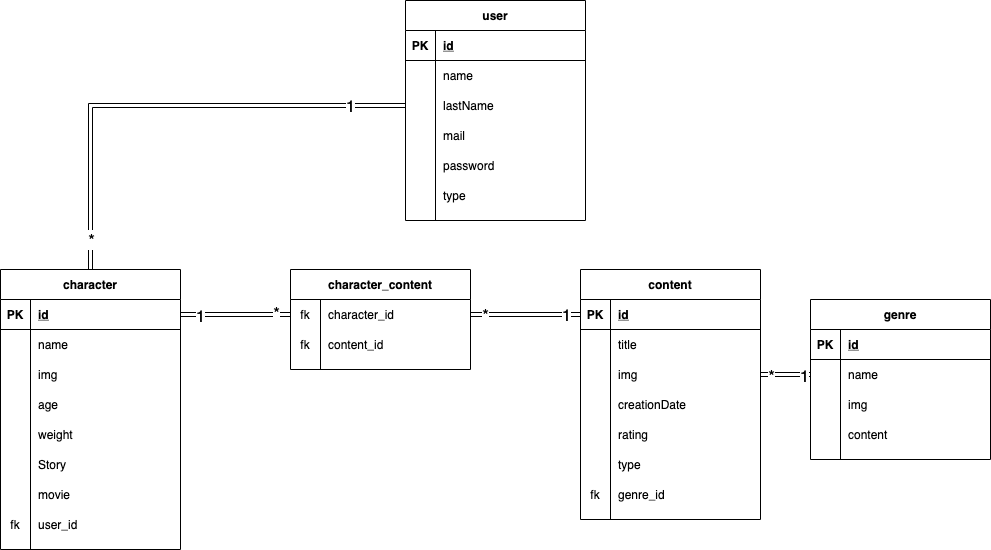
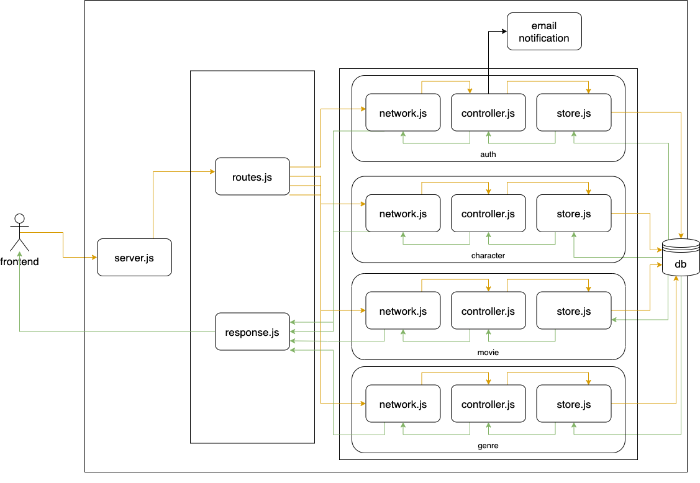

# alkemy-nodejs

### `Day 1`

**05/10/21**
1. Design db
<figure>
    
    <figcaption>db</figcaption>
     
</figure>

2. Arquitecture
<figure>
    
    <figcaption>db</figcaption>
     
</figure>

3. Setup

Package
- bcryptjs
- colors
- cors
- dotenv
- express
- express-validator
- jsonwebtoken
- morgan
- pg
- pg-hstore
- sequelize
- standard

4. db and models feature/db

5. Endpoints

### `Day 2`

**06/10/21**
6. JWT and express-validator

7. Register/Login -> with 

8. Characters -> Create

9. Characters -> List

10. Characters -> Delete

### `Day 3`

**07/10/21**
11. Characters -> Update

